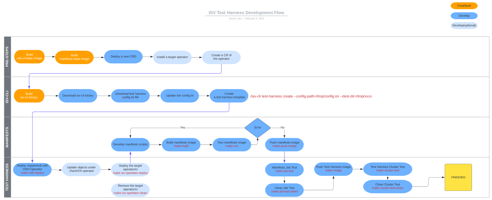

# Test Harness & Manifests Development Workflow
`isv-cli test-harness create` command provides templates folders: XXX-operator-test-harness, XXX-operator-manifests
This document explains the development workflow with the 2 repositories.

## Workflow Diagram

## Pre-steps
*Flow*
- [Build ods-ci base image](build-images.md)(skippable)
- [Build manifests base image](build-images.md)(skippable)
- Deploy a new OSD (*Login to the cluster after a new OSD cluster is created*)
- Install a target operator(optional)
- Create a sample CR of the operator(optional)

**(Note)** If you don't install operator and create a sample CR in pre-steps, you have to do it in the Test Harness development part.

## ISV-CLI
isv-cli binary help you to have template test harness,manifests folders and these folders will be pushed to your own git repository. In order to use the isv-cli, you must download and update config.ini file. 

*Flow*
- Build isv-cli binary(skippable)
- Download isv-cli (please ch)
  ~~~
  export ADDON_HOME=/tmp/addon
  mkdir $ADDON_HOME
  cd $ADDON_HOME
  wget https://github.com/Jooho/isv-cli/releases/download/v0.4/isv-cli
  chmod 777 ./isv-cli
  ~~~
- Download a sample config.ini
  ~~~
  curl -L https://raw.githubusercontent.com/Jooho/isv-cli/main/templates/test-harness/example-config.ini -o $ADDON_HOME/config.ini
  ~~~
- Update the sample config.ini
  ~~~
  vi $ADDON_HOME/config.ini
  [Customize]
  PRODUCT_NAME=%UPDATE%                      # ex) pachyderm
  OPERATOR_CRD_API=%UPDATE%                  # ex) kfdefs.kfdef.apps.kubeflow.org
  GIT_REPO_HOST=%UPDATE%                     # ex) https://github.com
  GIT_REPO_ORG=%UPDATE%                      # ex) Jooho
  GIT_REPO_BRANCH=%UPDATE%                   # ex) master
  IMG_REG_HOST=%UPDATE%                      # ex) quay.io
  IMG_REG_ORG=%UPDATE%                       # ex) jooholee
  
  JUPYTERHUB_NAMESPACE=%UPDATE%              # ex) opendatahub   If you did not set it, redhat-ods-applications will be used

  JUPYTER_NOTEBOOK_PATH=%UPDATE-Optional%    # ex) ${MANIFESTS_NAME}/notebooks/tensorflow
  JUPYTER_NOTEBOOK_FILE=%UPDATE-Optional#    # ex) TensorFlow-MNIST-Minimal.ipynb     
  ~~~
- Execute isv-cli to create 2 folders
  ~~~
  ./isv-cli test-harness create --config-path=${ADDON_HOME}/config.ini --dest-dir=${ADDON_HOME}/test-harness-repos
  ~~~

## [Test Harness 1](./diagrams.md)
You have to go back and forth between the test harness and manifests folder and continue. First, you need to do the following in the Test harness folder.

*Flow*
- Deploy Juypterhub with ODH Operator
  ~~~
  cd ${ADDON_HOME}/test-harness-repos/XXXX-operator-test-harness
  make odh-deploy
  ~~~
- Update objects under ./hack/XXXX-operator folder (Optional)
  *This folder has 4 files(CS,CR,OG,SUBS) but you don't need to use them all. If you remove some files, you have to update Makefile as well. However, this is an option, and you can directly install the operator and CR in Pre-step.*
  ~~~
  You have to update targets(isv-operator-deploy isv-operator-clean) in Makefile if you delete any files from ./hack/XXXX-operator folder
  ~~~
- Deploy the target Operator/CR (optional)
  ~~~
  make isv-operator-deploy
  ~~~

## [Manifests](./diagrams.md)
In this case, you will actually develop a check to see if the components that should be installed by ISV ADDON are working properly.

*Flow*
- Develop manifests scripts
  *The manifests folder created in the ISV-CLI does not check kubernetes objects by default, only the smoke jupyter notebook is tested, so it operates normally without special additional development. Therefore, you can test the default behavior using the following steps(build,run)*
  ~~~
  cd ${ADDON_HOME}/test-harness-repos/XXXX-operator-test-manifests

  vi ./basictests/operator.sh
  # Need to update these parts:  test_operator(), test_ods_ci()
  # Please read the comments
  ~~~
- Build manifests image
  ~~~
  make build
  ~~~
- Run manifests image (Test the scripts and notebook)
  ~~~
  make run
  ~~~
- Push Manifests image
  *If development is finished and there are no errors, push the Manifests image.*
  ~~~
  make push-image
  ~~~

## [Test Harness 2](./diagrams.md)
Now that Manifests development has been completed, it is necessary to test the corresponding manifests image using the test harness. First, by creating a Job object yourself, test the manifest image you created on the cluster. If no problem occurs, test the addon by deploying the Test Harness image in the form of a pod directly on the cluster. The Test Harnness image checks whether the Juypterhub is Ready, and then checks whether the CRD used by the ADDON exists. Then, in the same way as in the job test, the test harness image creates a job and tests the Addon using the manifests image you created.

*Flow*
- Manifests Job Test
  ~~~
  make job-test
  ~~~
- Clean Job Test
  ~~~
  make job-test-clean
  ~~~
- Push Test Harness Image
  ~~~
  make image
  ~~~
- Test Harness Cluster Test
  ~~~
  make cluster-test
  ~~~
- Clean Cluster Test
  ~~~
  make cluster-test-clean
  ~~~

**Cluster Test Verify**
You can check the files that are generated by Test Harness before you clean the cluster test step above.

*File List*
- add-metadata.json
- junit.xml
- error.log

*Check the log*
  ~~~
  oc logs ${TEST_HARNESS_NAME}-pod -f -c operator
  ~~~

*Check output files that are generated by test harness*
  ~~~
  oc rsh ${TEST_HARNESS_NAME}-pod
  cd /test-run-results
  cat junit-odh-operator.xml
  cat add-metadata.json
  cat error.log              --> when test harness failed.
  ~~~
